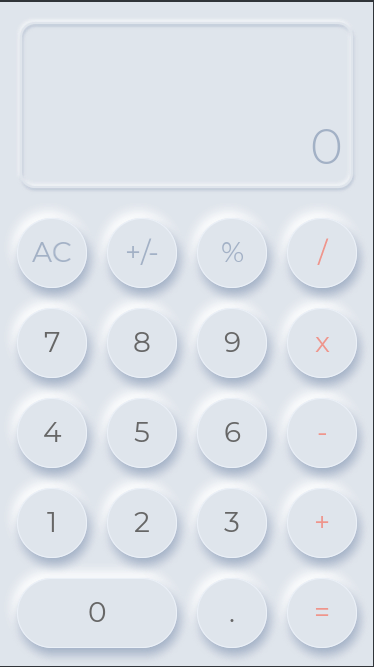

# NeuCalculator
 Simple calculator with Neumorphic desing
 
## Was made in two variants:
- The [First](Observables/) was made by [Fuse's Observables](https://fuseopen.com/docs/fusejs/observable.html) way
- The [Second](ModelApi/) was made by [Fuse's ModelApi aka FuseJS](https://fuseopen.com/docs/fusejs-beta/fusejs.html) way

